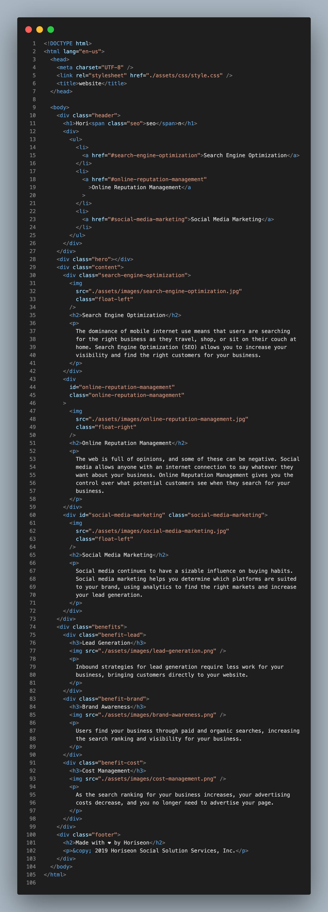
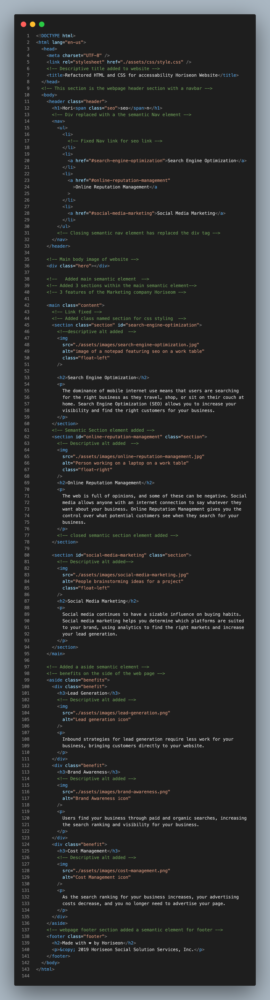
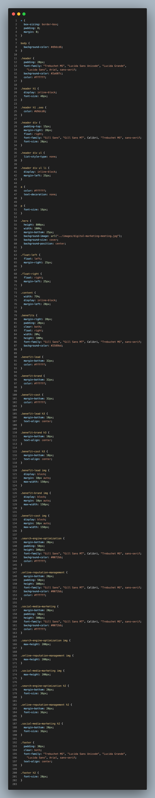
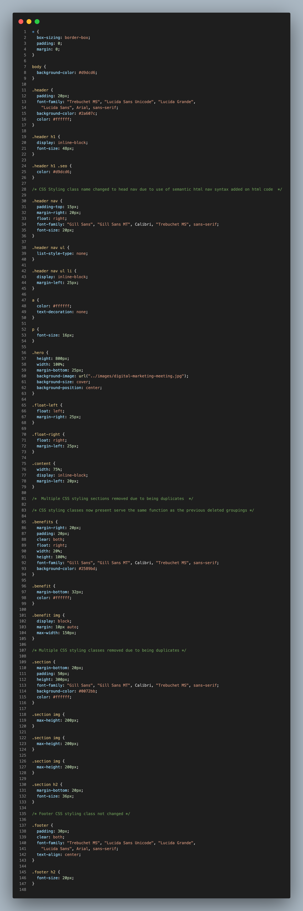

## Read Me

## Link to deployed GitHub Page:[Website](https://jonisd.github.io/horiseon-marketing-website/)

## Project Title: Refactoring the HTML and CSS for Horiseon website.

## Description:

The client required the developer to deploy semantic HTML syntax onto the original code provided by respective client. Moreover, the client also, required the developer to streamline down the original css styling syntax to make it more professional and streamlined.

The original code provided was heavily filled with divs which is known in the industry as divsoup due to the excessive use of divs without the implementation of semantic html. Thus, the subsequent deployment of semantic html syntax in regards to this respective mark-up enables the site to become more readable, descriptive to developers and browsers. Furthermore, making the site more accessible to screen-readers which are used by individuals who are visually impaired. Moreover, the use of semantic html syntax within the framework of the code optimizes the site to become much more SEO friendly. Thus, further elevating the website higher on relevant search engine result pages as the html used makes content easier for the search engine to interpret.

**_Semantic HTML Syntax used_**

1. Header
2. Nav
3. Main
4. Section
5. Article
6. ALT
7. Aside
8. Footer

**_ CSS _**

The CSS classes originally provided by the client contained many duplicates of the same classes doing the same intended styling functions. Hence, duplicates were removed and thus, the css styling became much more professional and streamlined. In addition, css styling classes were renamed due to the changes implemented in the HTML framework due to the added usage of semantic HTML being deployed.

## Technologies:

The technologies used for this respective project are HTML (Semantic) and CSS.

## Screenshots:

Original Code

Semantic Code

deployed page result

Original CSS Styling

Changed CSS Styling

